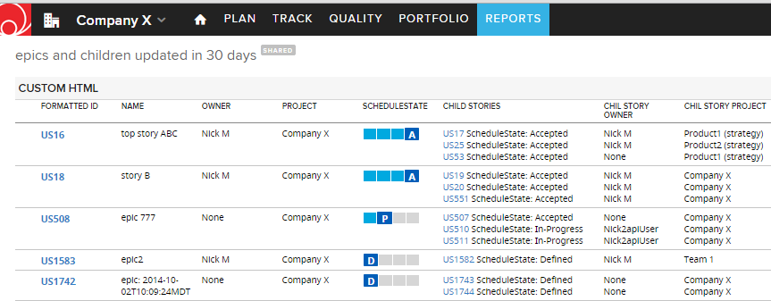
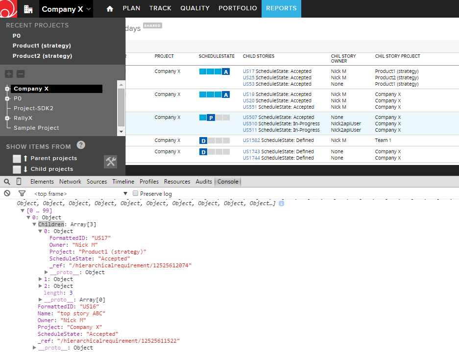

Epics with Children Stories
=========================

## Overview

Here is the same app showing the children collection of the epic(parent) story in the javascript console.
The global project scoping rules are not relevant here: child stories from the child projects are included in the collection.

This app is vailable AS IS. It is NOT supported by Rally.
## License

AppTemplate is released under the MIT license.  See the file [LICENSE](./LICENSE) for the full text.

##Documentation for SDK

You can find the documentation on our help [site.](https://help.rallydev.com/apps/2.0rc2/doc/)
